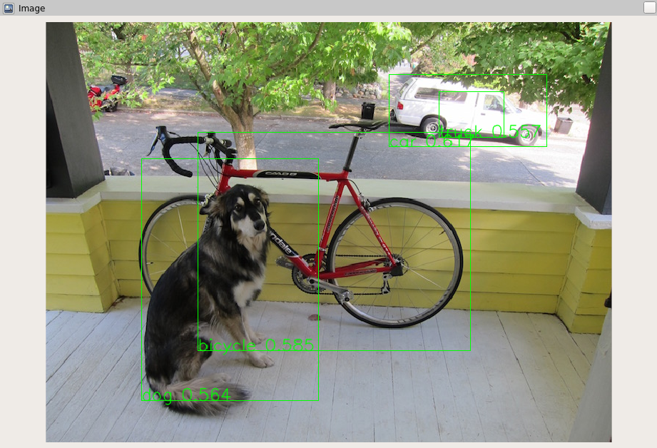

# Open Robotics Darknet ROS

This is a ROS 2 wrapper around [darknet](https://pjreddie.com/darknet), an open source neural network framework.



## DetectorNode

This node can run **object detectors** like [YOLO v3](https://pjreddie.com/darknet/yolo/) or [YOLO v7](https://github.com/WongKinYiu/yolov7) on images and video streams.

### Subscribers

* `~/images` (type `sensor_msgs/msg/Image`) - Input mages to feed to the detector

### Publishers

* `~/detections` (type `vision_msgs/msg/Detection2DArray`) - Objects detected in an image (if any)

### Parameters

* `network.config` - a path to a file describing a darknet detector network
* `network.weights` - a path to a file with weights for the given network
* `network.class_names` - a path to a file with names of classes the network can detect (1 per line)
* `detection.threshold` - Minimum probability of a detection to be published
* `detection.nms_threshold` - Non-maximal Suppression threshold - controls filtering of overlapping boxes

### Launching

When compiling the package with

```bash
colcon build --cmake-args -DDOWNLOAD_YOLO_CONFIG=ON
```

CMake will download the pretrained YOLO v3 and v7 configuration files to the `config` folder.

Alternatively can train YOLO to detect custom objects like described [here](https://github.com/AlexeyAB/darknet#how-to-train-tiny-yolo-to-detect-your-custom-objects) and save the following as `detector_node_params.yaml`:

```yaml
detector_node:
  ros__parameters:
    network:
      config: "./yolov3-tiny.cfg"
      weights: "./yolov3-tiny.weights"
      class_names: "./coco.names"
    detection:
      threshold: 0.25
      nms_threshold: 0.45
```

Finally you can run the detector node with

```
ros2 run openrobotics_darknet_ros detector_node --ros-args --params-file /your/path/to/detector_node_params.yaml
```

and publish images on `~/images` to get the node to detect objects.

You can also manually remap an external topic to the `~/images` topic with:

```
ros2 run openrobotics_darknet_ros detector_node --ros-args --params-file /world_model_ws/src/detector_node_params.yaml -r '~/images:=/your/camera/topic'
```

